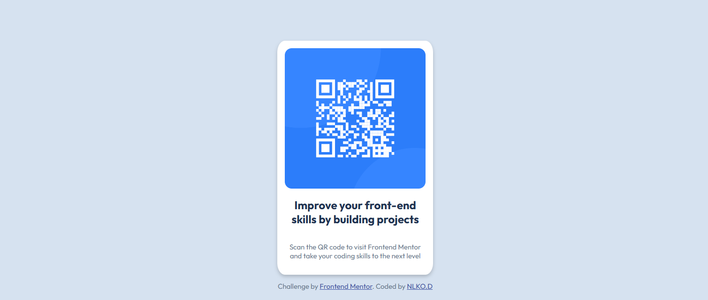

# Frontend Mentor - QR code component solution

This is a solution to the [QR code component challenge on Frontend Mentor](https://www.frontendmentor.io/challenges/qr-code-component-iux_sIO_H). Frontend Mentor challenges help you improve your coding skills by building realistic projects. 

## Table of contents

- [Overview](#overview)
  - [Screenshot](#screenshot)
  - [Links](#links)
- [My process](#my-process)
  - [Built with](#built-with)
  - [What I learned](#what-i-learned)
  - [Continued development](#continued-development)
  - [Useful resources](#useful-resources)
- [Author](#author)
- [Acknowledgments](#acknowledgments)

**Note: Delete this note and update the table of contents based on what sections you keep.**

## Overview
The project is that of a QR Code styled centrally on a webpage.

### Screenshot

### Links

- Solution URL: [Add solution URL here](https://your-solution-url.com)
- Live Site URL: [Add live site URL here](https://your-live-site-url.com)

## My process

### Built with

- Semantic HTML5 markup
- CSS custom properties
- Flexbox
- Mobile-first workflow

### What I learned

I took a look at an article on color codes to see what the difference between HSL and RGBA were, having almost always used RGBA when given the choice. I learnt that RGBA is an opacity-based colour model whereas HSL is hue based. RGBA is more traditional and better suited for precise control over colour and opacity, whereas HSL is better for working with colour combinations and gradients, and is more intuitive and flexible.

### Continued development

I'll be trying out HSL in most of my future projects in order to get a hang of it and of course, see if I might eventually prefer it over the RGBA colour model.

### Useful resources

- [HSL and HSLA vs. RGB and RGBA in CSS](https://www.blog.logrocket.com/hsl-hsla-vs-rgb-rgba-css/) - This helped me in understanding the differences between HSLA and RGBA.

## Author

- Website - [Add your name here](https://www.your-site.com)
- Frontend Mentor - [@yourusername](https://www.frontendmentor.io/profile/yourusername)